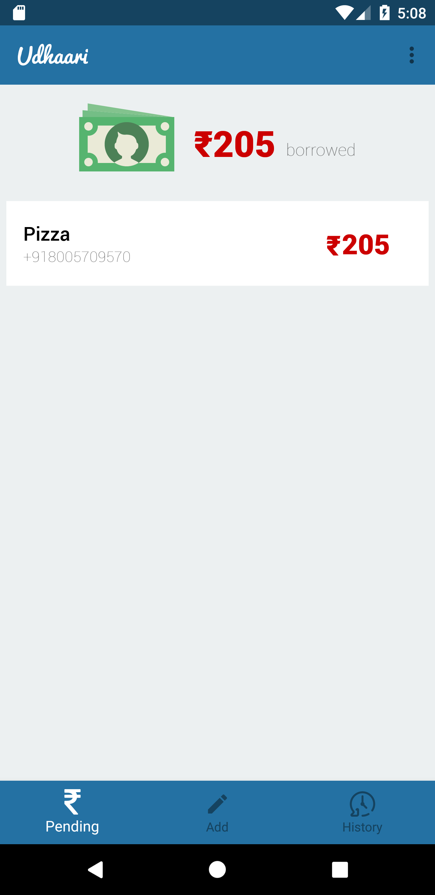
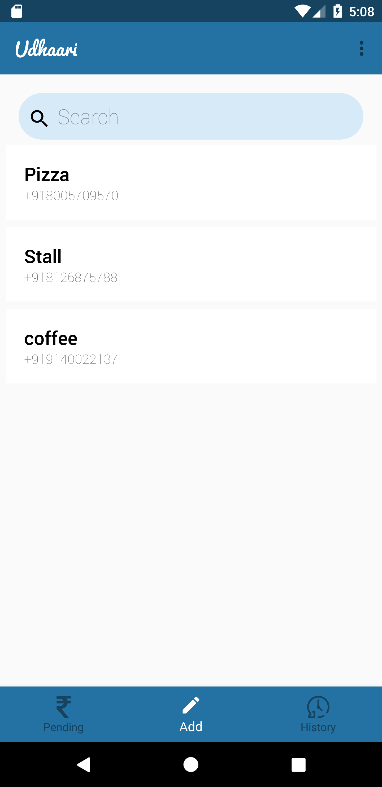
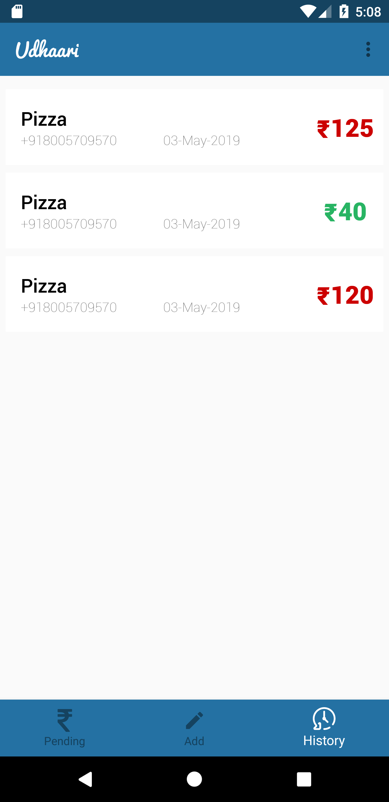
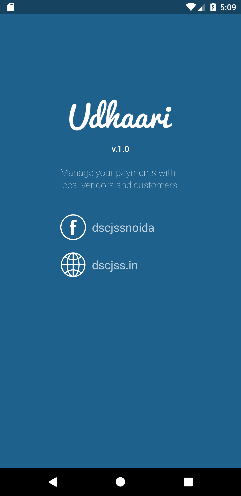

# Udhaari
This is an Android Application developed by DSC JSS for maintaing transaction records between Vendors and Customers. The main purpose behind the application was to minimize the loss of data which customer is vending how much money and when did he returned that to the shop owner. 

## Getting Started

### Requirements
* Android version 5.0 and above
* Minimum SDK version 21

### Screenshots
&nbsp;&nbsp;&nbsp;&nbsp;
&nbsp;&nbsp;&nbsp;&nbsp;

### Features Integrated
* Recyclerview
* Fragments
* Search Option
* Firebase for user login Authentication
* Firebase as realtime Database to store the data of user

### About

* The App serves as a ledger to maintain the records of the people vending some money.
* Every record is saved on the Firebase Database so it is safe and secure.
* The app is acurate so there will be no totalling mistake and hence user will be in no loss.
* The app maintain the data of amount along with the details of product bought.

### Some use case Scenarios
* Mobile Shops/ Recharge Shops
* Any small and medium business doing sales on credit
* Kirana Shops/ General Stores/ Grocery Stores/ Provission Stores
* Medical Stores/ Local Pharmacy 
* Paan Shops
* Personal Credit Book

### Libraries Used
* 'com.google.android.material:material:1.1.0-alpha05'
* 'androidx.cardview:cardview:1.0.0'
* 'androidx.recyclerview:recyclerview:1.0.0'
* 'com.chaos.view:pinview:1.4.3'

##### logging and injection
* 'com.jakewharton.timber:timber:4.7.1'
* 'com.jakewharton:butterknife:10.1.0'
* 'androidx.legacy:legacy-support-v4:1.0.0'
* 'com.jakewharton:butterknife-compiler:10.1.0'

##### Firebase
* 'com.google.firebase:firebase-auth:16.2.1'
* 'com.google.firebase:firebase-firestore:18.2.0'
* 'com.google.firebase:firebase-core:16.0.8'
